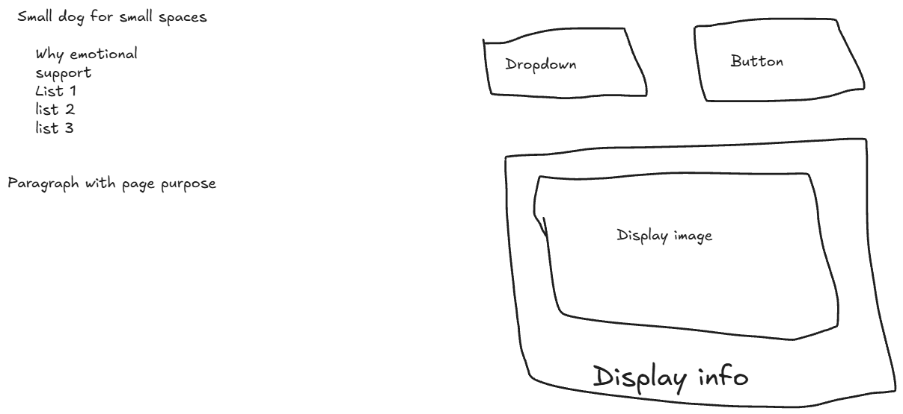

# dogs for secuity
## The problem
1. Which dogs are the smallest
2. Which dogs are the best for emotional support.
3. Which dogs have the best temperment.
4. Which dogs have the best temperment.

Individuals that live in smaller places will have a selection of the smallest dogs on an API list of over 100.

## Data
id,Name,Breed Group,Bred For,Minimum Life Span,Maximum Life Span,Minimum Height,Maximum Height,Minimum Weight,Maximum Weight,Temperament,Image
1,Affenpinscher,Toy,"Small rodent hunting, lapdog",10.0,12.0,9.0,12.0,6.0,13.0,"Stubborn, Curious, Playful, Adventurous, Active, Fun-loving",https://cdn2.thedogapi.com/images/0LJiOVlxp.jpg

##Links

Repo - https://github.com/BabySodaCodex/capstone2.git
Live - https://babysodacodex.github.io/capstone2/

## The plan

### Sections
Search — the box you type a breed name into and the button that runs it.
Results — one card per breed that matched, with its life span on it.

### User input

Visitor uses dropdown menu to choose from ten small dogs that would be suitable for an apartment.

### Outputs

Results show name, minimum weight, maximum weight, temperament.